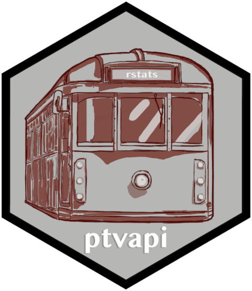

# ptvapi 
<!-- badges: start -->

[](https://cran.r-project.org/package=ptvapi)
[](https://cran.r-project.org/package=ptvapi)
[](https://github.com/mdneuzerling/ptvapi/tree/main)
[](https://github.com/mdneuzerling/ptvapi/actions)
[(https://github.com/mdneuzerling/ptvapi/actions?query=workflow%3Alinting)]
[](https://codecov.io/gh/mdneuzerling/ptvapi?branch=main)
[](https://choosealicense.com/licenses/mit/)

<!-- badges: end -->

This package provides a friendly interface to the Public Transport Victoria (PTV) Timetable API. Results are returned as data frames --- using real-time data where available --- and authentication is handled under the hood.

**This package is an unofficial wrapper of the Public Transport Victoria timetable API. The authors of this package are not associated with Public Transport Victoria.**

## Installing

### CRAN version

```
install.packages("ptvapi")
```

### Development version

```
remotes::install_github("mdneuzerling/ptvapi")
```

## Authentication

Using the API requires a user ID (also called a `devid`) and an API key from Public Transport Victoria. These can be requested in an email. Refer to the [PTV website](https://www.ptv.vic.gov.au/footer/data-and-reporting/datasets/ptv-timetable-api/) for instructions.

The user ID and API key be provided directly to the functions, for example:
```
routes(
  user_id = 1234567,
  api_key = "xxxxxxxx-xxxx-xxxx-xxxx-xxxxxxxxxxxx"
)
```

Alternatively, this information can be set as environment variables. These can be configured directly within R:
```
Sys.setenv("PTV_USER_ID" = 1234567)
Sys.setenv("PTV_API_KEY" = "xxxxxxxx-xxxx-xxxx-xxxx-xxxxxxxxxxxx")
```

If a `user_id` or `api_key` value is not provided to the functions within this package, then they will be retrieved from the "PTV_USER_ID" and "PTV_API_KEY" environment variables, if possible.

## Example usage

The code examples below assume that you've set environment variables for authentication.

```r
# tibble of all routes
routes()
# A tibble: 828 x 7
#   route_id route_gtfs_id route_name route_type route_number service_status
#      <int> <chr>         <chr>           <int> <chr>        <chr>    
```

```r
# Search for routes by name (case insensitive, partial matching supported)
routes(route_name = "Frankston")
# A tibble: 27 x 7
#   route_id route_gtfs_id route_name route_type route_number service_status
#      <int> <chr>         <chr>           <int> <chr>        <chr>    
```

```r
# All current disruptions
disruptions(disruption_status = "current")
# A tibble: 244 x 17
   disruption_mode disruption_mode… disruption_id title url   description
   <chr>           <chr>                    <int> <chr> <chr> <chr>       
# … with 177 more rows, and 17 more variables …
```

```r
# Train stops near Flinders Street Station
stops_nearby(
    latitude = -37.8183,
    longitude = 144.9671,
    route_types = "Train"
  )
# # A tibble: 1 x 8
#   stop_id stop_name stop_suburb route_type stop_sequence stop_latitude stop_longitude
#     <int> <chr>     <chr>            <int>         <int>         <dbl>          <dbl>
```

```r
# Upcoming train departures from Flinders Street Station
> departures(stop_id = 1071, route_type = "Train")
# A tibble: 75 x 12
   direction_id stop_id route_id run_id run_ref platform_number at_platform
          <int>   <int>    <int>  <int> <chr>   <chr>           <lgl> 
# … with 65 more rows, and 5 more variables: departure_sequence <int>,
#   scheduled_departure <dttm>, estimated_departure <dttm>, flags <chr>,
#   disruption_ids <list>
```

## A note about route types

The API recognises five route types: "Train", "Tram", "Bus", "Vline", and "Night Bus". Many functions have arguments such as `route_type` and `route_types` that expect a non-negative integer code representing these route types. To simplify calling the API, these functions will also accept a character description like those above. Under the hood, the functions will translate these descriptions to the non-negative integer codes that the API expects. For example, `routes(route_type = "Train")` is automatically translated to `routes(route_type = 0)`.

## Available functions

All API calls have been implemented. Some API calls have been combined into a single function with arguments, and some have been split into multiple functions. The following functions are available through this package:

* `departures`
* `directions`
* `directions_on_route`
* `disruption_information`
* `disruption_modes`
* `disruptions`
* `disruptions_at_stop`
* `disruptions_on_route`
* `fare_estimate`
* `outlets`
* `outlets_nearby`
* `patterns`
* `route_information`
* `route_types`
* `routes`
* `run_information`
* `runs_on_route`
* `search_outlets`
* `search_routes`
* `search_stops`
* `stop_information`
* `stops_nearby`
* `stops_on_route`      

---

Hex logo by Phizz Leeder
